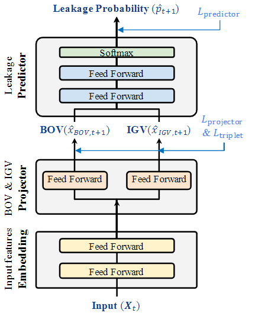
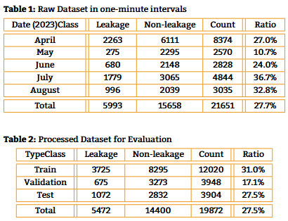

# Compressor Leakage Detection
---
## Leakage Prediction Model

- The definition of IGV and BOV in compressor are given as follows:
    - Inlet Guide Vane (IGV): A device that controls the air inflow to
a system. It controls airflow direction or pressure to maintain
or optimize desired system conditions.
    - Bleed Off Valve (BOV): A device that releases air generated at a
specific point due to certain factors. It regulates overpressure
within a system by removing air from specific areas.

---
## Dataset
- Description
    - A real-world compressor dataset is collected from a manufacturing plant from April 2023 to August 2023.
    - The dataset is preprocessed and provided in "data" folder.
        - Null and invalid values are removed.
        - Noisy features are eliminated.
        - All values are normalized.
        - Time series are chunked into batches.

- Feature
    - The features are described in "data/columns.json"

- Normalization
    - IGV and BOV are normalized with standard normalization.
    - All input features are normalized with minmax normalizaiton.

---
## Train Model
    python src/trainModel.py --repetition=10 --gpu-memory=4096

- A folder with trained models is generated under "models" folder 
- Trained models are managed by the time of their creations

---
## Inference Model

    python src/inferenceModel.py --gpu-memory=4096

- Accuracy, $F_1$ score, cross entory loss, and confution matrix are calculated and presented.
- True and predicted BOV and IGV are visualized and saved under "figures" folder.

